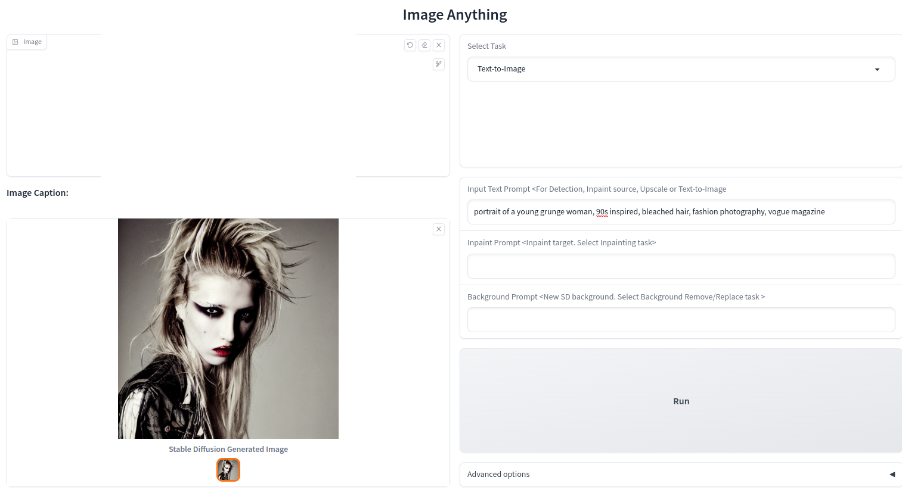
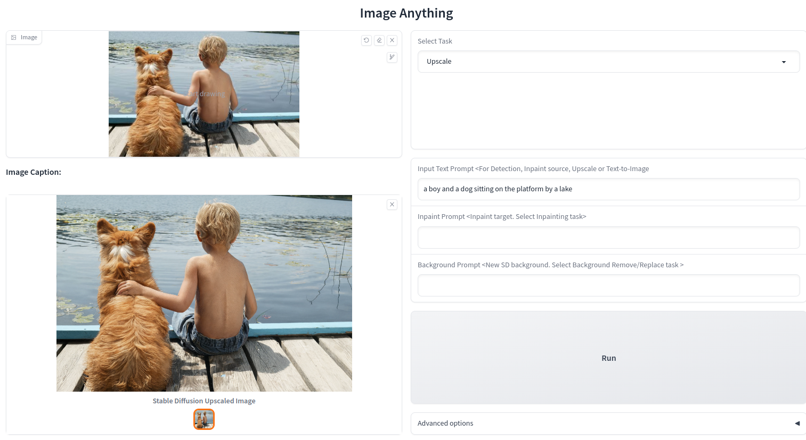
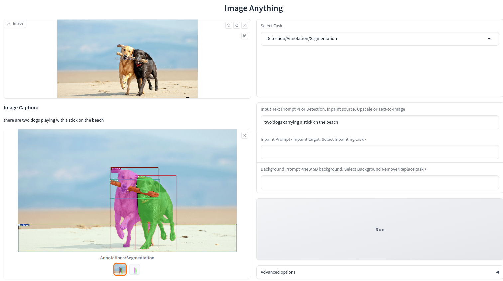
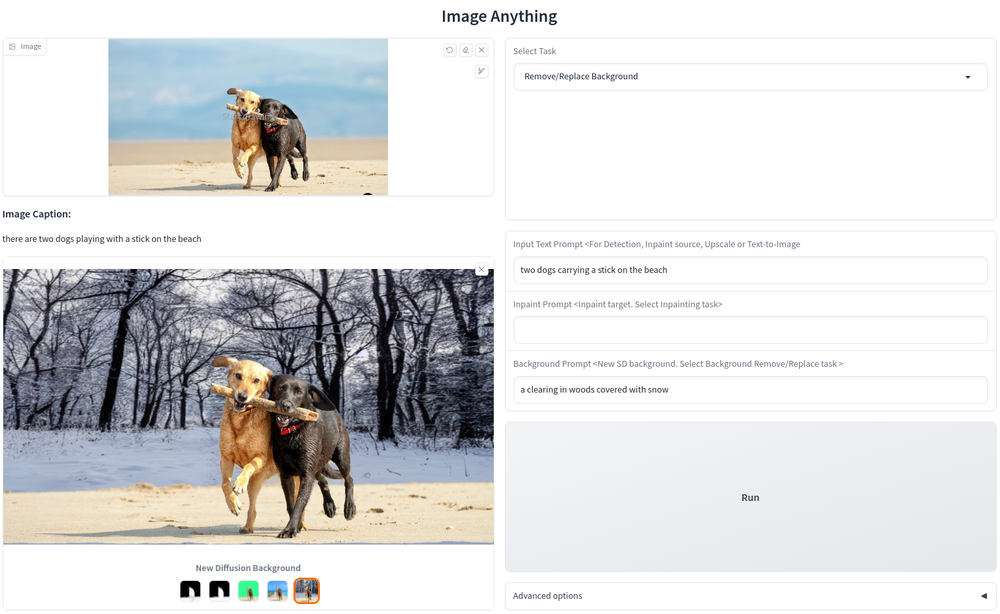
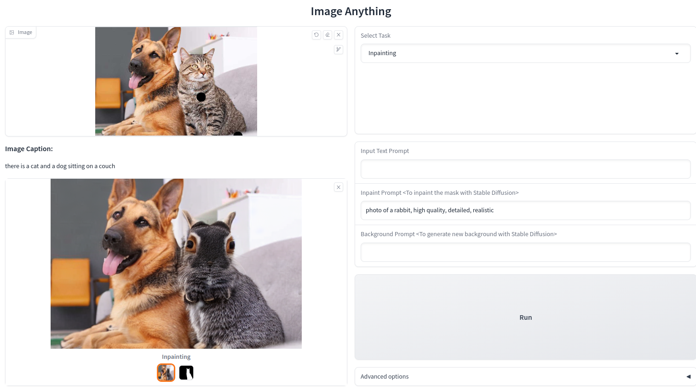
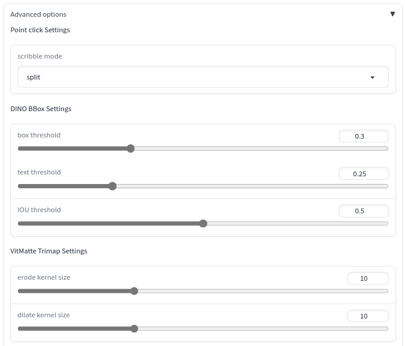
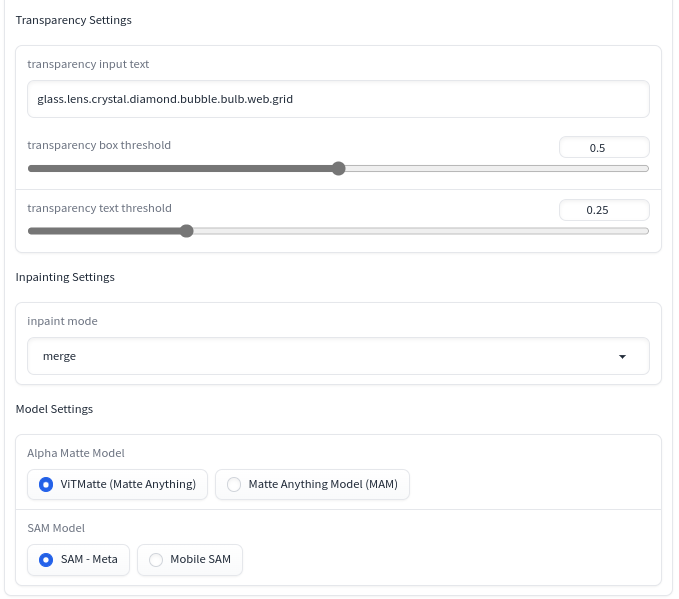

#  
Image Anything
A gradio demo of image models.

The project incorporates image generation and editing models in concert to perform various tasks.  

Current Supported Tasks:  
1. Image captioning
2. Generate auto SAM mask
3. Objects detection, segmentation, annotation
4. Remove / replace background
5. Inpainting
6. Upscale image 4x
7. Text to image

Models used:
* Segment Anything (SAM)
* Grounding DINO
* Matte Anything (ViTMatte - Hust Labs)
* Stable Diffusion 2
* BLIP
* Mobile SAM -> TBD
* Matte Anything Model (MAM - SHI Labs) -> TBD  

 

 
