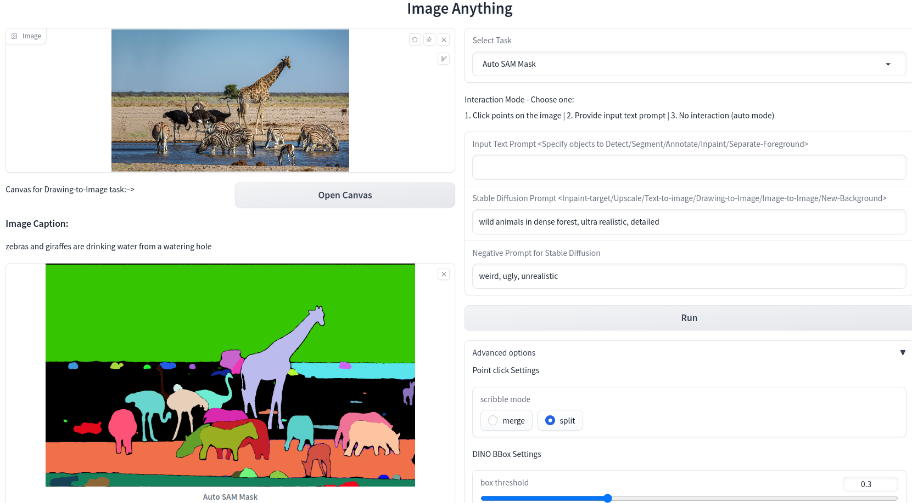
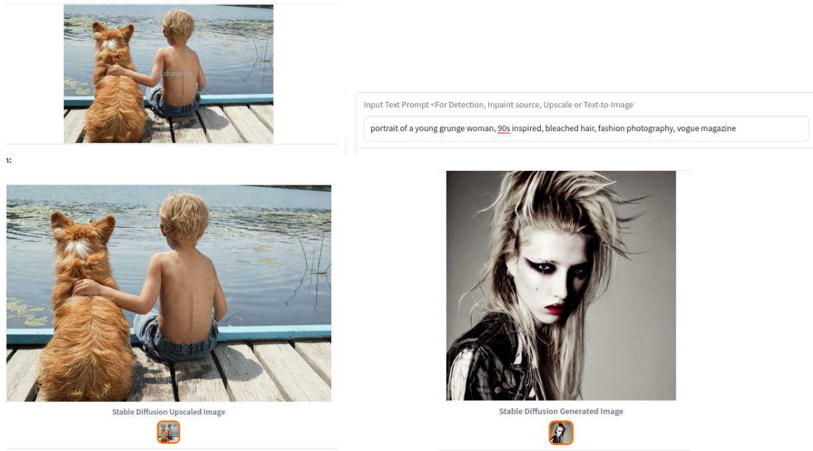
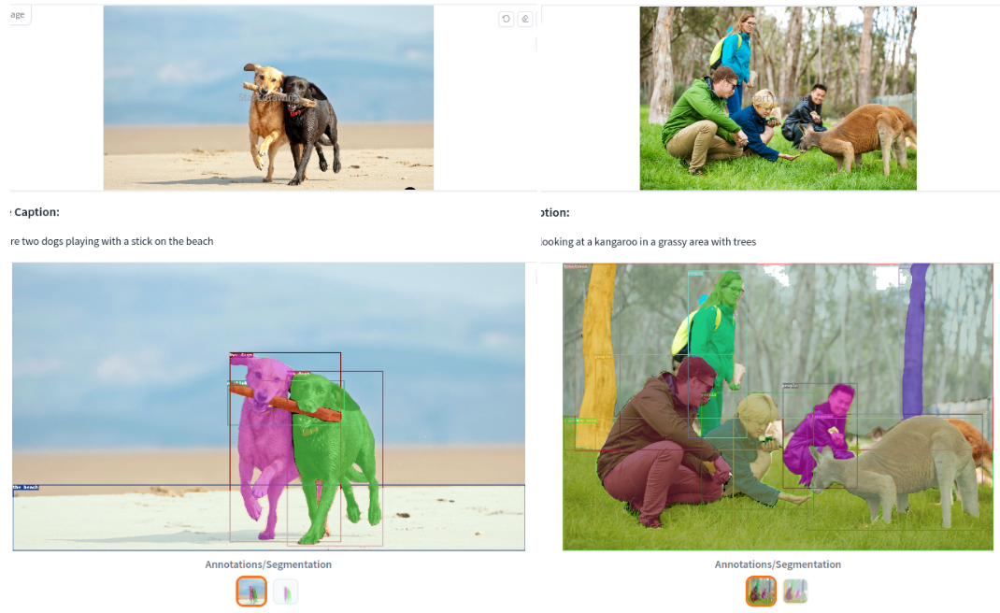
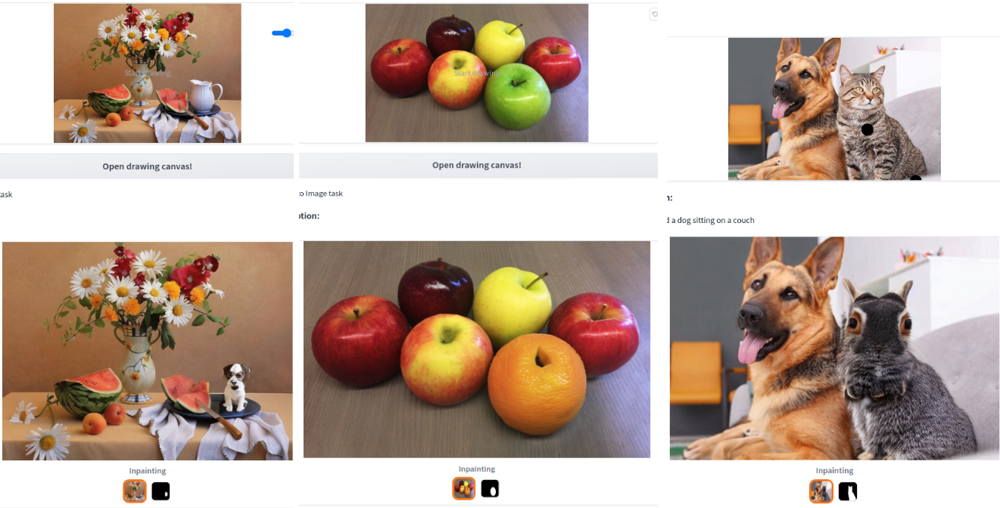
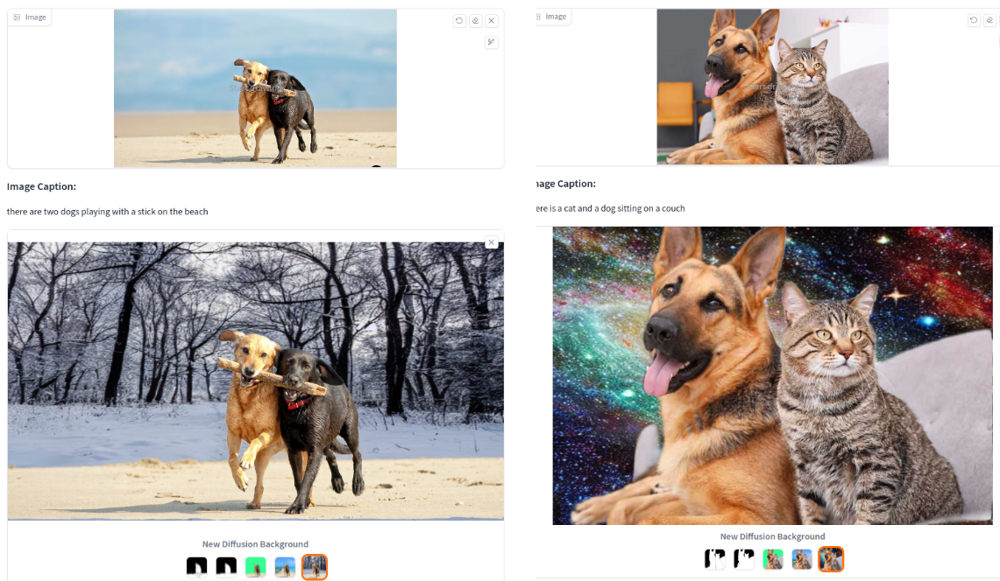
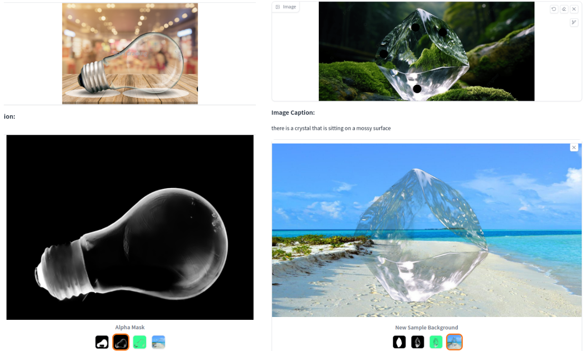
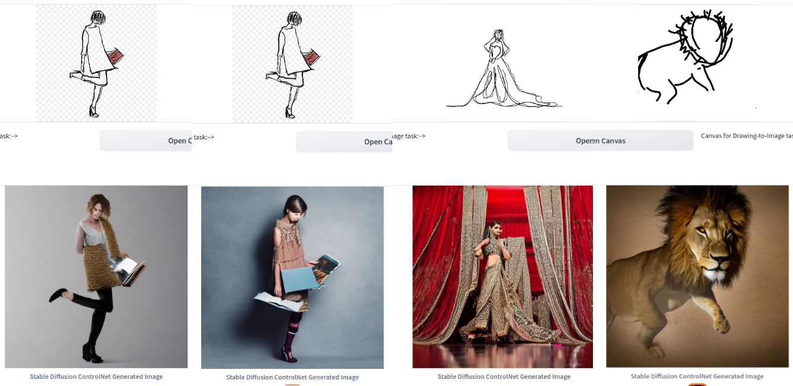
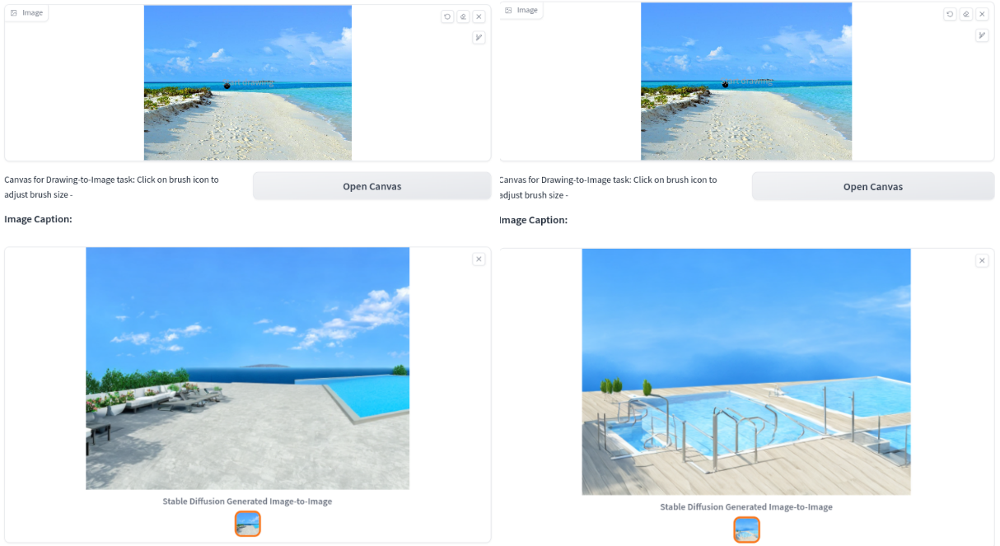
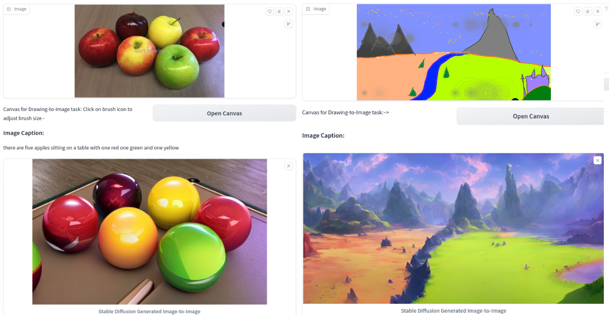
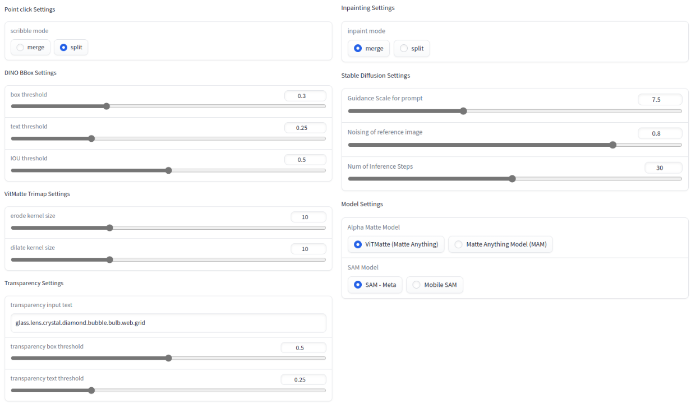

#  
Image Anything
   
A gradio demo of image models. Refer to [colab notebook](image_anything.ipynb) for setup.  

The project incorporates image generation and editing models in concert to perform various tasks.  

Currently Supported Tasks:
1. Image captioning
2. Generate auto SAM mask
3. Objects detection, segmentation, annotation
4. Remove / replace background
5. Inpainting
6. Upscale image 4x
7. Text to image 
8. Drawing to image
9. Image to image  
 

Interaction modes:
* Selecting points on the image
* Text prompts
* Auto mode
* Drawing
* Upload image mask -> TBD
* Audio -> TBD  
 

Models used:
* Segment Anything (SAM)
* Grounding DINO
* Matte Anything (ViTMatte - Hust Labs)
* Stable Diffusion 2 (Hugging Face diffusers)
* Stable Diffusion Controlnet 
* BLIP
* Mobile SAM
* Matte Anything Model (MAM - SHI Labs) -> TBD  
 

TBD: 
* Options to choose from checkpoints e.g. Stable Diffusion versions
* Options to further control SD generation
* More tasks e.g. image editing with more models
* 

 

###  App Snaps
Auto SAM Mask: 
 

Upscale Task and Text to Image Task:
  

Annotations: 
  

Inpainting (tea pot -> puppy ||  green apple -> orange || cat -> rabbit):  
  

Remove/Replace Background (SD generated backgrounds):  
  
Remove Background for Transparent objects:
  

Drawing to Image:  
  

Image to Image A. (prompt for terrace swimming pool):
  

Image to Image B. (prompt for 1: pool table with balls, 2:fantasy landscape on artstation):
  

Advanced Settings to tune the results:  
 

## Acknowledgements
* [Grounded Segment Anything](https://github.com/IDEA-Research/Grounded-Segment-Anything) (inspiration and helpers)
* [Segment Anything](https://github.com/facebookresearch/segment-anything/)
* [GroundingDINO](https://github.com/IDEA-Research/GroundingDINO)
* Stable Diffusion with [Hugging Face diffusers](https://github.com/huggingface/diffusers)
* [Controlnet](https://github.com/lllyasviel/ControlNet)
* [Matte-Anything](https://github.com/hustvl/Matte-Anything)
* [Mobile SAM](https://github.com/ChaoningZhang/MobileSAM)
* [BLIP](https://arxiv.org/abs/2201.12086)