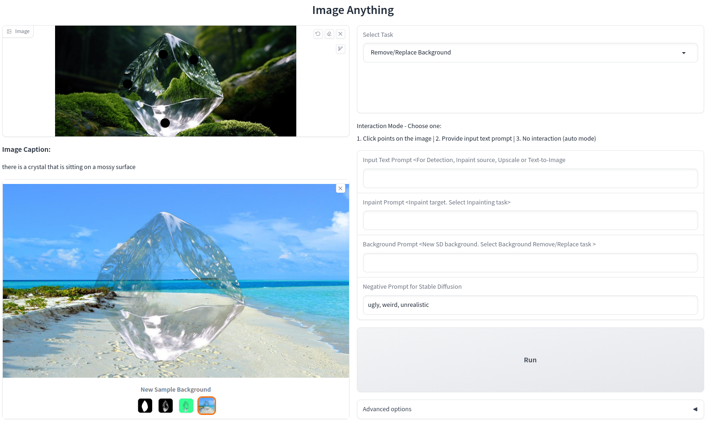
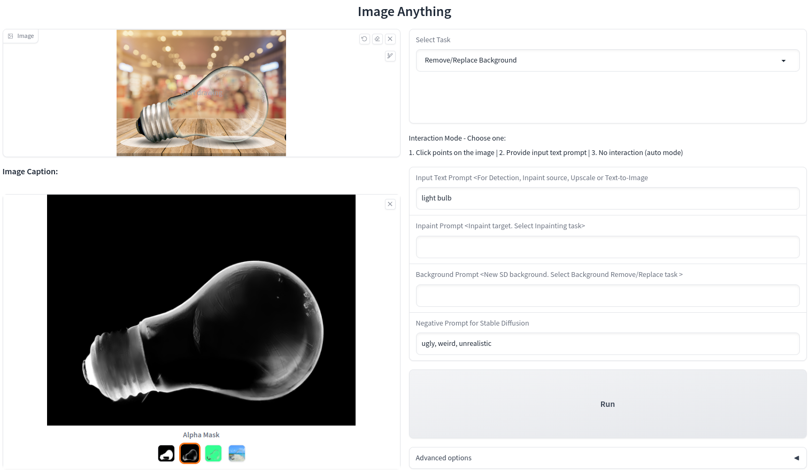

#  
Image Anything
A gradio demo of image models. Refer to [colab notebook](image_anything.ipynb) for setup.

The project incorporates image generation and editing models in concert to perform various tasks.  

Currently Supported Tasks:  
1. Image captioning
2. Generate auto SAM mask
3. Objects detection, segmentation, annotation
4. Remove / replace background
5. Inpainting
6. Upscale image 4x
7. Text to image  
 

Interaction modes:
* Selecting points on the image
* Text prompts
* Auto mode
* Input image mask -> TBD
* Audio -> TBD  
 

Models used:
* Segment Anything (SAM)
* Grounding DINO
* Matte Anything (ViTMatte - Hust Labs)
* Stable Diffusion 2 (Hugging Face diffusers)
* BLIP
* Mobile SAM
* Matte Anything Model (MAM - SHI Labs) -> TBD  
 

TBD: 
* Options to choose from checkpoints e.g. Stable Diffusion versions
* Options to control SD generation
* More tasks e.g. image editing with more models
* 

 

 
